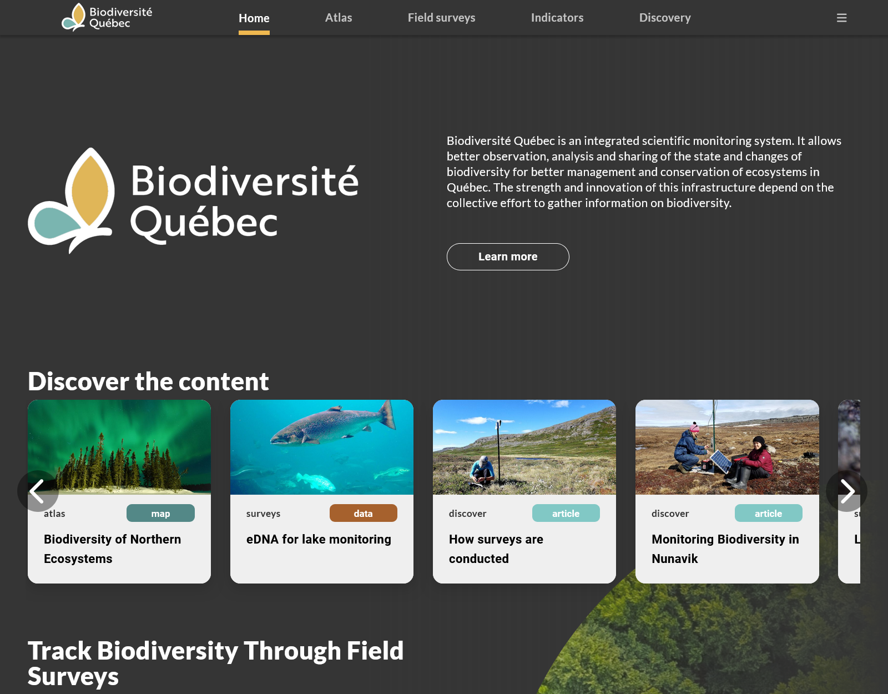
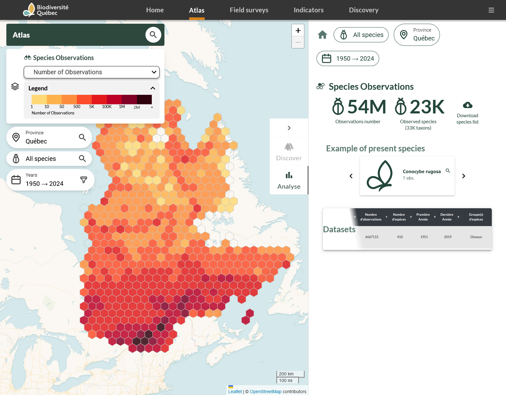
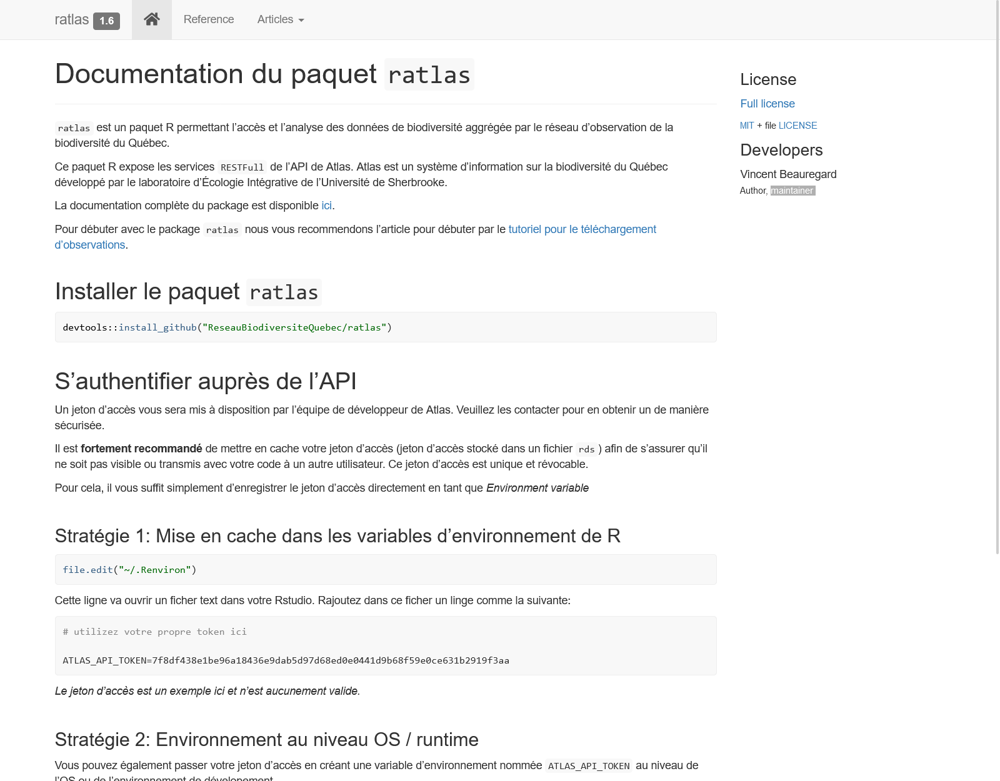
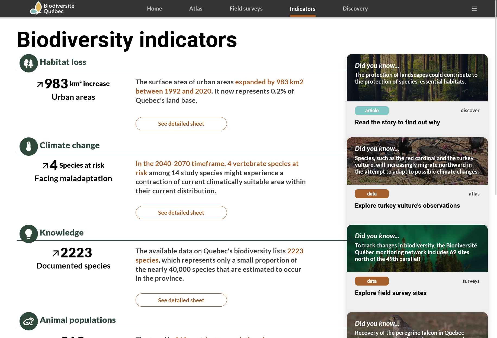
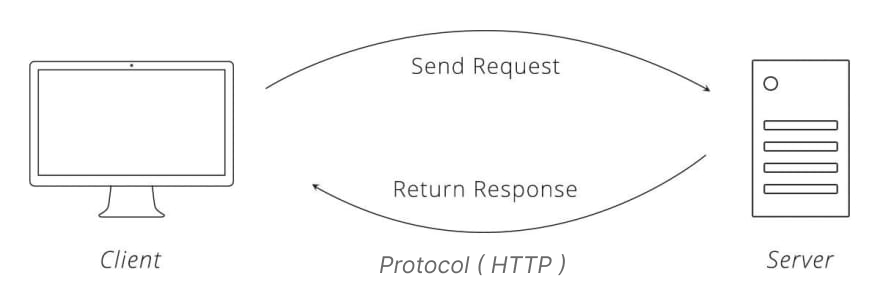
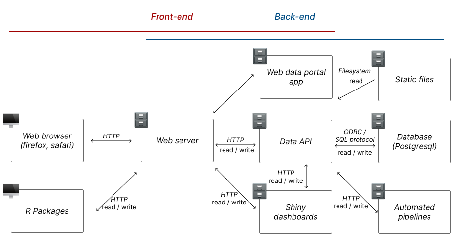
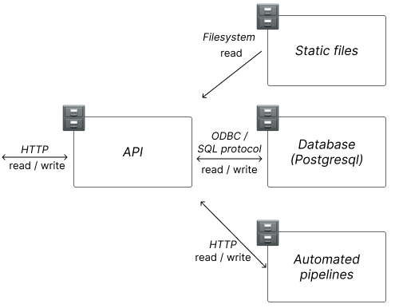
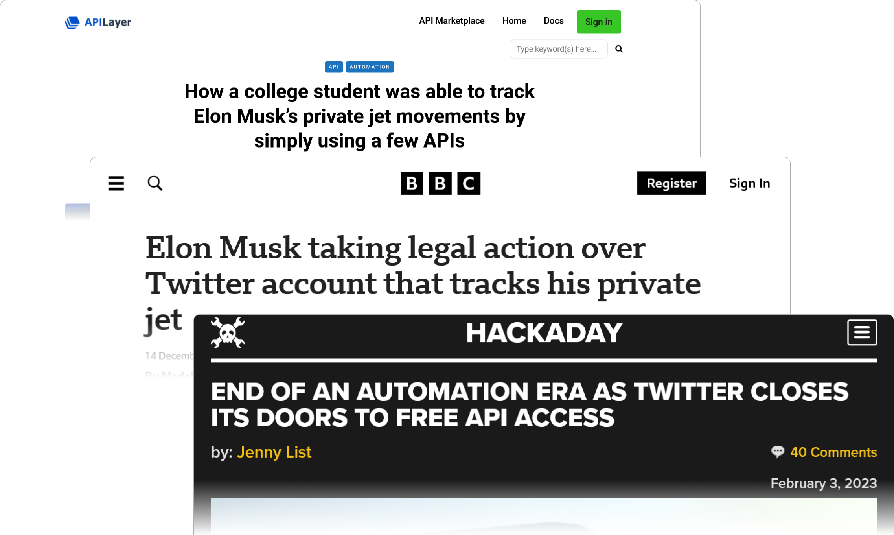
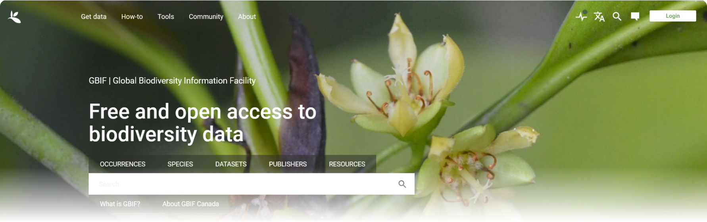

class: middle

## Accessing Biodiversity Data 🦌💾

.h3[**( Using code & web sources 🌐 )**]

.footer[

.h3[École d'été 2024]


]

???

Coding access to Biodiversity Data
Programmatic access to Biodiversity Data
Web Access to Biodiversity Data
Using code to access Biodiversity Data

---

class: center, middle


.circle-100[]

.h2[Vincent Beauregard], data person

.footer[


]

---

.img-fill[]

---

.img-fill[]

---

.img-fill[]

---

.img-fill[]

---

### Requirements for data architecture

* 🌐 Data portal for exploration and visualization

* 📊 Indicator dashboards for monitoring

* 📡 Packages & API for programmatic access

* 👨‍🔧 Pipelines for automated processing

* 📡 Data access control, authorization and security
* 📌 FAIR - Findable, Accessible, Interoperable, Reusable

* ... And many more

<br/>

.center[***🌐✨All possible through modern web based data systems✨🌐***]

---

class: middle

### Todays's objectives 🎯

* Fundamentals behind web based data systems
  
* Access and use data from web APIs using HTTP requests and R
  
* Access spatial environmental data
  
---

class: center, middle

### 🙋‍♀️🙋‍♂️Have you used R or APIs to Access data ?

???

Who here have done some data processing using R ?
Who has used code to access biodiversity data ? (Ask what datasource)
Who has made requests to web apis ? 
Who have done some web apps or web development ?
Who would declare themselves good at data processing using R (or any other language ? 
Who would say they definitely need practice ?

---

class: middle

## 🤓 Web fundamentals

.h3[Client-Server model]

.w-50[]

* **🖥 Client examples** : Software that requests services or resources from the server

* **🗄 server examples** : Software that provides services or resources to the client

* **📡 Protocol examples** : Rules that define how the client and server communicate and exchange data ie. HTTP

* **✉ Request-Response model** : Client sends a request to the server, server processes the request and sends a response back to the client

.center[***🌐✨This is the functional units of all web-based systems✨🌐***]

---

### 🤓 Client-Server example : 🌐 Web browsing

.columns[

.column[
**🖥 Client examples** :

* Web browser (Chrome, Firefox, Safari)
* R packages (httr, curl)

**🗄 Server examples**

* Web server (Apache, Nginx)
* Web app server (Node.js, Django, Shiny)

**📡 Protocol examples** : HTTP & HTTPS (Hypertext Transfer Protocol)
]

.column[
***Steps to navigate websites***

**1. Request** : Client sends a request to the server to access a website

**2. Response** : Server processes the request and sends back the website content (HTML, CSS, JS, etc) to the client.

**3. Display** : Client displays the website content to the user


]
]

---

class: middle

### 👨‍🏫 Demo : Under the browser hood using a browser & developper tools

???

[link to the demo](https://www.lapresse.ca)

---

### 🤓 Client-Server example: Email services 📫

.columns[

.column.small[

**🖥 Client examples**

* Email desktop applications (Outlook, Thunderbird)
* Email web applications (Gmail, Outlook.com)

**🗄 Server examples**

* Email servers (MS Exchange, Postfix)

**📡 Protocols examples**

* SMTP (Simple Mail Transfer Protocol) - for sending emails
* IMAP (Internet Message Access Protocol) - for receiving emails
* POP3 (Post Office Protocol) - for receiving emails

]

.column[

***Steps to sync emails***

**1. Request**: Client sends a request to the server to access or send emails

**2. Response**: Server processes the request and sends back the email content or status to the client as a response

**3. Display**: Client displays, stores, or manipulates the email content

.carousel[


]
]
]

---

### 🤓 Client-Server example: Database access 🗄️

.columns[

.column.small[

**🖥 Client examples**

* Database clients (MySQL Workbench, pgAdmin)
* R packages (dbi, RMySQL)
* Web applications (Shiny, Dash)
* APIs (plumber, FastAPI)

**🗄 Server examples**

* Database servers (MySQL, PostgreSQL, SQLite)
* APIs (RESTful, GraphQL)

**📡 Protocols examples**

* ODBC (Open Database Connectivity)
* HTTP (for Web APIs)

]

.column[

***Steps to query a database***

**1. Request**: Client sends an SQL query or API request to the server to access or modify data

**2. Response**: Server processes the request and sends back the data or status to the client as a response

**3. Display**: Client displays, stores, or manipulates the data

.carousel[


]
]
]

???
* Words client and server can be both hardware or software
* There may be multiple clients and servers in a single machine, at the same time
* Let's explore some examples of architecture and protocols

---

### 🤓 Web architecture

All hardware and software components of a system and how they interact (clients, servers, communication protocols, etc.)




???

Front-end : Components that users interact with (web pages, maps, etc.)
  
Back-end : Components that manage data and functionalities (APIs, databases, servers, etc.)

✨HTTP is the dominant communication protocol to access the functionalities✨

---

class: middle

### 🤓 Web architecture


Combining different components to provide functionalities to users

.columns[

.column[

* 🌐 Web pages
* 🗺 Interactive maps, dashboards & visualization
* 📡 Data access & storage (read, write, update, delete)
* 📥 Downloadable files
]

.column[
* 📊 Data processing
* 🔐 User authentication & management
* 📧 Newsletter & automated emails
* ... and many more
]
]


Front-end : Components that users interact with (web pages, maps, etc.)
  
Back-end : Components that manage data and functionalities (APIs, databases, servers, etc.)


✨HTTP is the dominant communication protocol to access the functionalities✨

???

Visuals : simple web architecture, data system architecture with API

---

class: middle

### 📡 How machines talk to each other - HTTP

* Define how messages are formatted and transmitted (request-response model)

* CRUD operations (Create, Read, Update, Delete) possible using HTTP methods

* Supports different data formats (HTML, JSON, XML, binary, etc.)

---

class: middle

### 📡 HTTP Request
  
**METHOD** : `GET` (Read)

**URL**

```http
https://api.gbif.org/v1/occurrence/search?taxonKey=3119195&limit=10
{protocol}://{domain}/{path}{?query}
```

**HEADERS**

```http
Content-Type: text/html, application/json, image/jpeg, */*, etc.
Authorization: Bearer {token}
```

**BODY** Only for POST, PUT, DELETE

```http
{"key": "value"}

example

{"taxonKey": 3119195,
"limit": 10}
```

---

### 📡 HTTP Response

**STATUS CODE ** (See [http cat for more status codes](https://http.cat/))
```http
200 - OK
201 - Created
401 - Unauthorized
404 - Not Found
500 - Internal Server Error
```

**HEADERS**
```http
Content-Type: application/json
Date: {date}
Server: {server}
```

**BODY**
```json
{"results": [
  {"key": 1,
  "scientificName": "Bubo scandiacus"},
  ...
]}
```

???


---

### 👨‍🏫 Demo : Using R as a browser to make http requests

```R
# STEP 0 - Load the libraries
library(httr2) # -> for HTTP requests
library(htmltools) # -> for handling HTML content

# STEP 1 - Make request to the web app (API, Website, etc.)

# Make a GET request to the website
response <- httr2::request("https://www.lapresse.ca") |>
  httr2::req_perform()

# Print the response content
print(response)

# STEP 2 - Parse the response content as an R friendly object

website <- httr2::resp_body_string(response) |>
  htmltools::HTML()

# STEP 3 - Visualize and process the content

htmltools::browsable(website)
```

---

class: middle

### 📡 How machines talk to each other : APIs

API = Application Programming Interface. A way to access the functionalities of a web application programmatically

.columns[

.column.small[

- ✨ HTTP as the communication protocol to access the functionalities✨

- Endpoint : Unique path fore each function & data class

- Data manipulation (filtering, sorting, etc.) through http query parameters
  
- CRUD operations (Create, Read, Update, Delete) through HTTP methods

- Stateless : all information needed is in the request and not stored on the server (RESTful)

]

.column.middle[
  


]

]

Much of the web 2.0 rely on APIs to provide functionalities different UIs, users and systems (github, facebook, twitter, google maps, gbif, inaturalist, etc.)

???

[Github API](https://docs.github.com/en/rest)

---

### 📡 When APIs made Elon angry

.web-preview[]


---

class: middle

### 👨‍🏫 Demo : Exploring gbif website and its api

What kind of  data can we find on GBIF ? How can we access it ? Can we manipulate the data ? Can we download it ?



[🔗GBIF Website](https://www.gbif.org/)

???

What kind of  data can we find on GBIF ? How can we access it ? Can we manipulate the data ? Can we download it ?

✅ Access to different data classes through endpoints (occurrences, species, datasets, etc.)

✅ Search through records using filters

✅ CRUD operations (Create, Read, Update, Delete)

✅ Download data in different formats (JSON, CSV, dwc-a, etc.)

✅ Authorization and access control