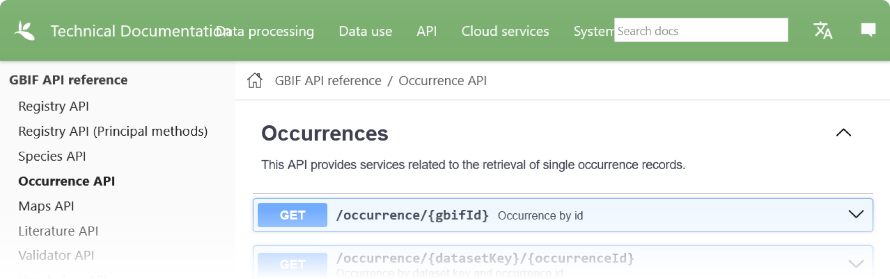

class: middle

---

class: center, middle

## 👨‍💻 Accessing Biodiversity Data in R

---

class: middle

## Different sources for biodiversity data

Data is stored and made accessible in three different ways :

1. **📥 Static Files** : Downloadable files accessible via HTTP (csv, xlsx, shapefile, etc.).

2. **📡 APIs** : Web services that provide access to data through HTTP requests (GBIF, iNaturalist, global names, etc.). Also enables CRUD operations and function calls.

3. **🚀 Cloud-Optimized Formats** : Big data stored as static files in the cloud, but optimized for fast access and processing (Parquet, Large environments raster files, etc.). 

???

* Static files is the most basic way to share data, but it is still widely used and very useful for small datasets or simple data structures.
  * Limitations : Heavy on file manipulation, if data is updated, the file must be re-uploaded, no real-time data access.
  * Essentials to know how to access and manipulate static files in R.

---

### Workflow of data access

**📥 Step 1** : Import data 

These data can be stored in various formats : csv, xlsx, shapefile, json, xml, etc, or binary data loaded from APIs or cloud-optimized formats.

**🔧 Step 2** : Data manipulation and cleaning

Store data in appropriate data structures for manipulation and analysis :

* Tabular data : Dataframes, tibbles
* Spatial data : `sf`, `stars` and `terra` packages objects

Manipulate data to transform, clean, filter, and subset data.

**📊 Step 3** : Data analysis and visualization

Perform statistical analysis, data visualization, and data exploration.

---

class: middle

### 📥 Accessing static files

Example : [Protected Areas on government website](https://www.donneesquebec.ca/recherche/dataset/aires-protegees-au-quebec)


???

Alot of data is shared as static files on the web. It is important to know how to access and manipulate these files in R.

🙋‍♂️ Raise your hand if you have already downloaded and parsed a file

---

class: middle

### 👨‍🏫 Demo : Accessing Quebec's protected areas data for governmental website

---

### 📥 R Packages to manipulate static file

**📥 Download and unzip data** : `download.file`, `unzip`

**📊 Tabular data** : `readr::read_csv`, `readxl::read_excel`, `haven::read_sas`, `readr::read_delim`

**🗺️ Spatial data** : `sf::st_read`, `raster::raster`, `stars::read_stars`, `terra::rast`

**📝 Other text files** : `readr::read_delim`,  `readr::read_file`

---

### 📡 Access data through APIs - Endpoints

Data is obtaine by making requests to APIs endpoins. Each endpoint is a URL that represents a specific data resource.

Endpoints examples from GBIF API :

* Occurrences : `https://api.gbif.org/v1/occurrence/search`
* Species : `https://api.gbif.org/v1/species`
* Datasets : `https://api.gbif.org/v1/dataset`



---

### 📡 Access data through APIs - Schema & relational model

Data is structured in a relational model, with multiple tables relationships defined by Primary Key (PK) and Foreign Key (FK).

.columns[
.column[
#### Occurrences Table
| OccurrenceID (PK) | taxonKey (FK) | datasetKey (FK) | Location | Date |
|-------------------|---------------|-----------------|----------|------|
| 001               | 1001          | 2001            | Forest A | 2022-04-10 |
| 002               | 1002          | 2002            | Lake B   | 2022-05-15 |
| 003               | 1001          | 2001            | Mountain C | 2022-06-20 |
]

.columns[

.column[
#### Species Table
| taxonKey (PK) | Scientific Name |
|---------------|-----------------|
| 1001          | Alfaroa Standl. |
| 1002          | Betula alba     |

]

.column[
#### Datasets Table
| datasetKey (PK) | Dataset Name       |
|-----------------|--------------------|
| 2001            | Forest Data Set    |
| 2002            | Aquatic Data Set   |
]
  
]

]

---

class: middle

### 📡 Access data through APIs - JSON Output

.columns[

.column[

JavaScript Object Notation

- Human Readable
- Lightweight
- Flexible
- Widely Supported
- R Packages
- GeoJSON

]

.column[

*Example `occurrence` JSON Output*

.small[
```json
{
  "occurrenceID": "urn:..:100889255",
  "datasetName": "Tropicos",
  "scientificName": "Alfaroa Standl.",
  "taxonKey": 311919,
  "taxonRank": "GENUS",
  "individualCount": 3,
  "basisOfRecord": "PRESERVED_SPECIMEN",
  "decimalLatitude": 8.68,
  "decimalLongitude": -80.600556,
  "eventDate": "2016-01-11",
  "country": "Panama",
  "rightsHolder": "Missouri Botanical Garden",
  ...
}
```
]

]

]

???

- **Web-Friendly**: JavaScript Object Notation designed for web applications.
- **Human Readable**: Easily understood format, both by humans and machines.
- **Lightweight**: Text-based structure makes it ideal for data interchange.
- **Flexible**: Easily represents simple data structures and associative arrays.
- **Widely Supported**: Most common structured data format on the web and in APIs.
- **R Packages** : Can be easily parsed in R using `jsonlite` package.
- **GeoJSON** : Spatial flavor of JSON, used for spatial data interchange.


---

### 📡 Access data through APIs - Queries and pagination


**Parameters** :Queries are made by adding parameters to the URL, such as `?speciesKey=311919`

Examples of parameters : `http://api.gbif.org/v1/occurrence/search?taxonKey=311919&limit=100`

This feature allows to filter, sort, and subset data directly from the API, without downloading the entire dataset.

For example, GBIF API allows to filter occurrences by `scientificName`, `country`, `year`, `basisOfRecord`, `geometry`, etc. See [GBIF API documentation](https://www.gbif.org/developer/occurrence#search-parameters) for more details.

**Pagination** : Number of records returned for each request can be limited. Pagination using `offset` and `limit` parameters allows to retrieve large datasets in chunks through multiple requests.

---

### 📡 Relational model of an API

Good for : Large datasets, complex data structures, real-time data, read-write operations

Common packages to make and handle API requests : `httr2`, `jsonlite`, `curl`

Many biodiversity data sources APIs have R packages facilitating data access :

* GBIF : `rgbif`
* Biodiversité Québec : `ratlas`
* iNaturalist : `rinat`
* Global names : `gnr`
* VertNet : `rvertnet`
* ebird : `rebird`, `auk`
* Aggregated sources : `spocc`

example : GBIF API, iNaturalist API, Gobal names API


---

class: middle

### 👨‍🏫 Demo : Accessing GBIF occurrences through its API

---

class: middle

### 📡 Access data through R package

**👨‍🏫 Demo** Querying GBIF data using R package

---

class: middle

### 📡 Access data through R package

---

### 🚀 Cloud-Optimized Formats

Data stored as static files in the cloud ☁, but optimized for fast access 🚀 and processing.

.columns[

.column[
#### 🌎 Spatial Raster Data
- **Data Types**: Landcover, climatic models
- **Format**: Cloud-optimized GeoTIFF
- **Access**: Use `stars` and `gdalcubes` packages for cloud storage and processing.
- **Tutorial**: [Accessing BQ IO Environmental Layers](https://biodiversite-quebec.ca/en/documentation/r-io)

**Important Data Sources**
- [Biodiversité Québec - IO](https://coleo.biodiversite-quebec.ca/apps/io-layers/chelsa-clim/bio1)
- [Google Earth Engine](https://developers.google.com/earth-engine/datasets/)
- [Microsoft Planetary Computer](https://planetarycomputer.microsoft.com/catalog)
]

.column[
#### 🐘 Large Datasets
- **Data Types**: GBIF occurrences, iNaturalist observations
- **Formats**: Parquet and Geoparquet (Columnar storage, like CSV but stronger 💪)
- **Access**: Use client packages like `duckdb`, `duckdbfs` to query data directly without full download.
- **Tutorial**: [Accessing BQ public data](https://biodiversite-quebec.ca/en/documentation/acces-atlas)

**Important Data Sources**
- [Microsoft Planetary Computer](https://planetarycomputer.microsoft.com/catalog)
- [Amazon AWS Open Dataset](https://registry.opendata.aws/)
]
]

---

class: middle

### 🤖 Data transformation and manipulation


.columns.small[

.column[
For tabular data
* Cleaning
* Filtering
* Summarizing
* Aggregating
* Joining
]

.column[
For spatial data
* Projections (Change coordinate reference system)
* Spatial joins (On intersect, within, etc.)
* Aggregations (Sum area for each category)
* Geometric operations & measurements (Buffer, Area, Distance, Intersect, Union, etc.)
* Raster operations (Resampling, Zonal statistics, Polygonize, Classification, etc.)
]

]

.footer.small[
*Source : [R for Data Science](https://r4ds.hadley.nz/)*
]

---

class: middle

#### 📚 R resources for data manipulation and analysis

* 🧪 [R for Data Science](https://r4ds.hadley.nz/) by Hadley Wickham, Mine Çetinkaya-Rundel, and Garrett Grolemund.

* 🌎 [Spatial Data Science: With Applications in R ](https://r-spatial.org/book/) by Edzer Pebesma and Roger Bivand.